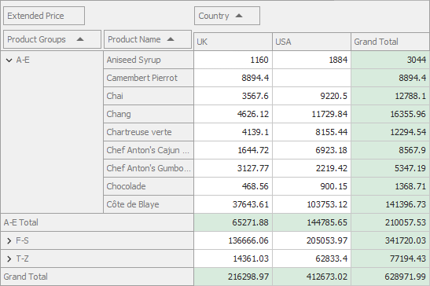

<!-- default badges list -->

<!-- default badges end -->
# Pivot Grid for WinForms - Custom Group Intervals

This example shows how to implement custom group intervals in Pivot Grid to group axis values.

<!-- default file list -->
## Files to look at

* [Form1.cs](./CS/CustomGroupInterval/Form1.cs) (VB: [Form1.vb](./VB/CustomGroupInterval/Form1.vb))
<!-- default file list end -->

## Overview

The _Product Groups_ calculated field is bound to the following expression:

`Iif(Substring([Product Name], 0, 1) < 'F', 'A-E', Substring([Product Name], 0, 1) < 'T', 'F-S', 'T-Z')`

The expression groups the _Product Name_ field's values into three large ranges: A-E, F-S, and T-Z according to product's start characters.

## Documentation

[Custom Group Intervals](https://docs.devexpress.com/WindowsForms/1846/controls-and-libraries/pivot-grid/data-shaping/grouping#custom)
